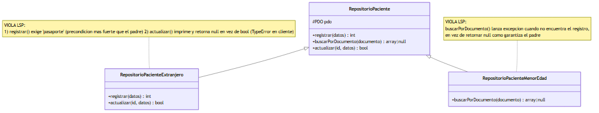
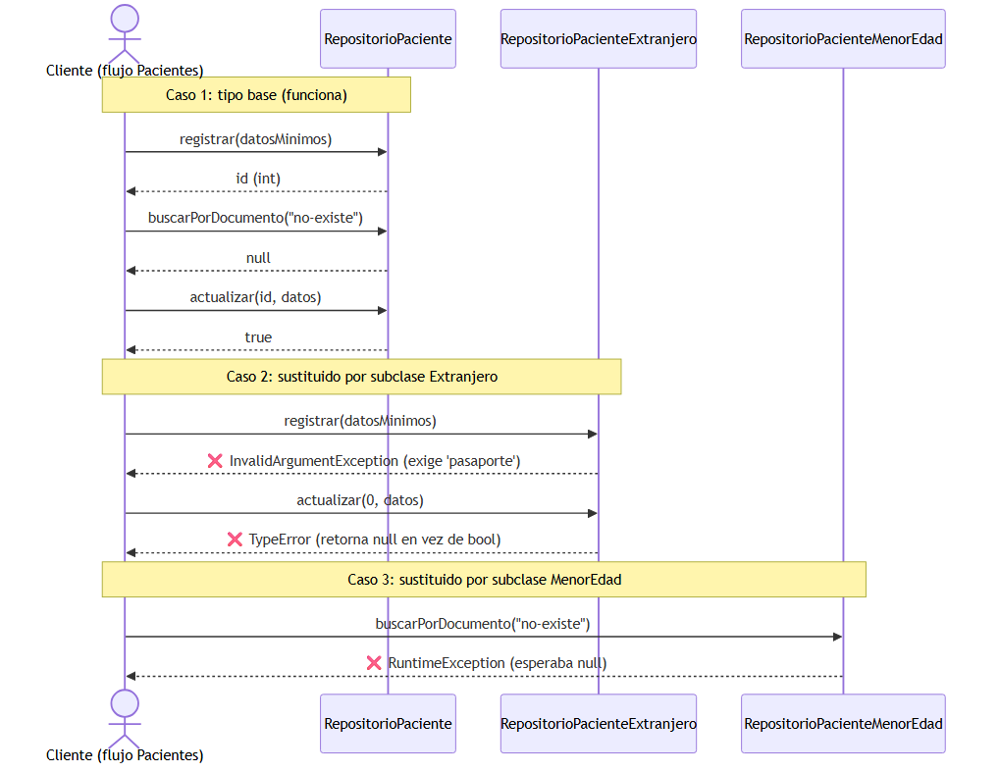
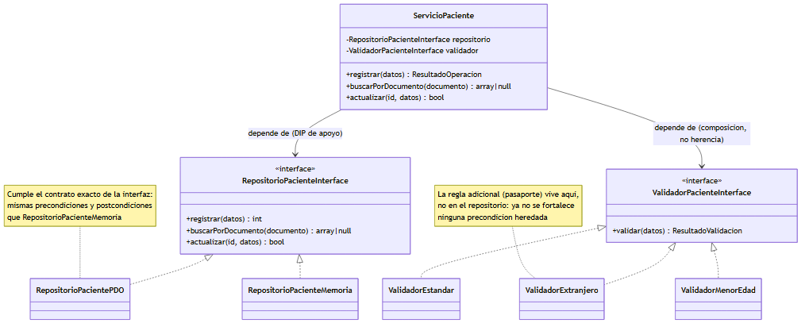
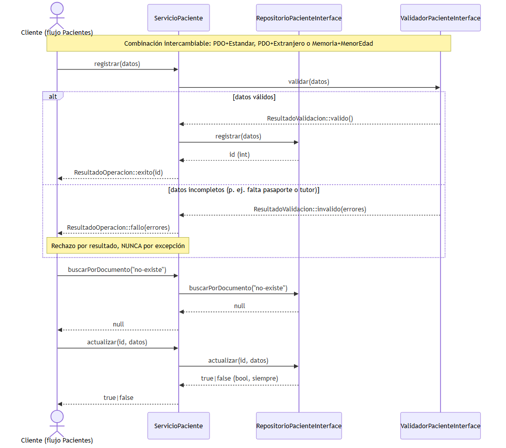

# Aplicación del Principio de Sustitución de Liskov (LSP) al flujo de Pacientes

## Portada

- **Estudiante:** Glendi Patricia Campos Orellana
- **GitHub:** Glendi20
- **Módulo oficial:** Pacientes: registro, edición, búsqueda y detalle
- **Alcance usado en la actividad:** Pacientes: registro, edición, búsqueda y detalle
- **Consigna individual:** Aplicar LSP al diseño del flujo «registro, búsqueda y actualización segura de un paciente»
- **Principio SOLID aplicado:** Liskov Substitution Principle (LSP)
- **Repositorio:** https://github.com/Glendi20/Tarea_Solid_AnalisisII
- **Rama evaluada:** main
- **Commit / etiqueta evaluada:** `[COMPLETAR: hash del commit o tag evaluado, ej. a1b2c3d]`
- **Fecha:** 14 de agosto de 2026

---

## Índice

1. [Introducción](#1-introducción)
2. [Desarrollo](#2-desarrollo)
   1. [Contexto y alcance del módulo](#21-contexto-y-alcance-del-módulo)
   2. [Principio SOLID aplicado: LSP (definición y cita exacta)](#22-principio-solid-aplicado-lsp-definición-y-cita-exacta)
   3. [Requisitos funcionales (RF)](#23-requisitos-funcionales-rf)
   4. [Requisitos no funcionales (RNF)](#24-requisitos-no-funcionales-rnf)
   5. [Criterios de aceptación](#25-criterios-de-aceptación)
   6. [Diseño ANTES: violación de LSP](#26-diseño-antes-violación-de-lsp)
   7. [Diseño DESPUÉS: aplicación correcta de LSP](#27-diseño-después-aplicación-correcta-de-lsp)
   8. [Justificación de responsabilidades y dependencias](#28-justificación-de-responsabilidades-y-dependencias)
   9. [Evidencia de ejecución y validación](#29-evidencia-de-ejecución-y-validación)
   10. [Evidencia Git](#210-evidencia-git)
3. [Conclusión](#3-conclusión)
4. [Bibliografía](#4-bibliografía)
5. [Anexos](#5-anexos)

---

## 1. Introducción

El módulo "Pacientes: registro, edición, búsqueda y detalle" concentra una de las operaciones más sensibles de un sistema de información hospitalaria (HIS): la gestión del registro maestro del paciente. Sobre este módulo conviven, en la práctica, distintas variantes del mismo concepto de "paciente" (estándar, extranjero, menor de edad), cada una con reglas de captura ligeramente distintas. Cuando esas variantes se modelan con herencia sin cuidar el contrato del tipo base, el resultado típico es un diseño donde las subclases *parecen* intercambiables por el tipo padre pero, al sustituirlas, rompen el comportamiento que el código cliente esperaba.

Este documento aplica el **Principio de Sustitución de Liskov (LSP)**, tomado exclusivamente de la fuente obligatoria del curso (MVP Cluster, "Diseño de software 2"), al flujo «registro, búsqueda y actualización segura de un paciente». Se presenta un diseño **ANTES** que viola el principio de forma deliberada y verificable, y un diseño **DESPUÉS** que lo corrige mediante composición e interfaces con contrato explícito, en lugar de herencia frágil. Ambos diseños están implementados en PHP 8.2 + PDO (ejecutable localmente contra SQLite en memoria, sin dependencias externas) y respaldados por una batería de pruebas de contrato que evidencia, empíricamente, tanto la violación como la corrección.

Todos los datos utilizados son **exclusivamente ficticios**; ninguno corresponde a una persona real ni constituye información clínica identificable.

---

## 2. Desarrollo

### 2.1 Contexto y alcance del módulo

El módulo de Pacientes cubre el ciclo: **registrar** un paciente nuevo, **buscar** un paciente existente (por documento) y **actualizar** de forma segura sus datos editables, preservando los campos de identidad. Sobre este ciclo existen variantes de negocio (paciente estándar, extranjero, menor de edad) que agregan reglas de captura adicionales sin que ello deba afectar a los módulos consumidores (admisión, expediente, citas), que sólo conocen el contrato genérico del flujo.

### 2.2 Principio SOLID aplicado: LSP (definición y cita exacta)

**Fuente obligatoria:** MVP Cluster. "Diseño de software 2". https://mvpcluster.com/diseno-de-software-2/ (consulta: 31 de julio de 2026). Autor: Luis Miguel Rodríguez González.

**Cita textual exacta** (sección "Liskov Substitution (Principio de Sustitución de Liskov)"):

> «Una clase derivada de otra debe poder ser sustituida por su clase base y debemos garantizar que los métodos de la primera no provoquen un mal funcionamiento de los métodos de la clase base.»

El artículo ilustra el principio con el clásico ejemplo de un `Cuadrado` que hereda de `Rectángulo` y, al sobrescribir sus métodos, produce comportamientos inesperados en el código que espera un `Rectángulo`. Esta actividad traslada esa misma idea —una subclase que "parece" válida por herencia pero rompe el contrato del padre— al dominio de pacientes: en vez de geometría, se usan repositorios y validadores de pacientes.

> **Aclaración de alcance:** este documento cita LSP porque es el principio explícitamente asignado a este módulo y el que la fuente obligatoria cubre. No se atribuyen a la fuente citada los principios DRY, KISS o YAGNI, ni se usan como fundamento de las decisiones aquí tomadas.

### 2.3 Requisitos funcionales (RF)

| ID | Requisito |
|----|-----------|
| RF-01 | El sistema debe permitir registrar un paciente nuevo con datos mínimos obligatorios (documento, nombres, apellidos, fecha de nacimiento) y datos opcionales (teléfono, dirección). |
| RF-02 | El sistema debe permitir buscar un paciente por documento de identidad, retornando el registro si existe o una ausencia de resultado (no un error) si no existe. |
| RF-03 | El sistema debe permitir consultar el detalle completo de un paciente ya registrado. |
| RF-04 | El sistema debe permitir actualizar de forma segura los campos editables (teléfono, dirección) de un paciente ya registrado, sin alterar sus campos de identidad (documento, fecha de registro). |
| RF-05 | El sistema debe admitir variantes de paciente con reglas de captura adicionales (paciente extranjero: pasaporte; paciente menor de edad: nombre del tutor) sin alterar el comportamiento esperado por los componentes que consumen el contrato genérico de registro/búsqueda/actualización. |
| RF-06 | Toda operación de registro, búsqueda o actualización debe quedar disponible para módulos consumidores a través de un contrato único, independientemente de la variante concreta de paciente o del mecanismo de almacenamiento (PDO, memoria, u otro). |

### 2.4 Requisitos no funcionales (RNF)

| ID | Requisito |
|----|-----------|
| RNF-01 | **Sustituibilidad (LSP):** cualquier implementación concreta del contrato de repositorio o de validación debe poder sustituir a su tipo/interfaz en cualquier punto del sistema sin alterar la corrección del programa cliente: sin fortalecer precondiciones, sin debilitar ni cambiar postcondiciones, sin lanzar excepciones no previstas por el contrato. |
| RNF-02 | **Mantenibilidad:** agregar una nueva variante de paciente o un nuevo mecanismo de almacenamiento no debe requerir modificar el código cliente que orquesta registro/búsqueda/actualización. |
| RNF-03 | **Testabilidad:** el cumplimiento del contrato debe poder verificarse automáticamente ejecutando la misma batería de pruebas contra todas las implementaciones concretas ("contract testing"). |
| RNF-04 | **Integridad de datos ficticios:** los datos usados en la demostración deben ser exclusivamente ficticios, sin información clínica identificable real, conforme a las instrucciones comunes de la actividad. |
| RNF-05 | **Trazabilidad de la evidencia:** cada ejecución de la demo o de las pruebas debe producir una salida capturable (consola) que sirva como evidencia verificable de comportamiento. |
| RNF-06 | **Rendimiento académico:** en el entorno local de demostración (SQLite en memoria), cada operación individual del flujo debe completarse en menos de 200 ms. |

### 2.5 Criterios de aceptación

| ID | Criterio (Dado / Cuando / Entonces) |
|----|--------------------------------------|
| CA-01 | **Dado** un conjunto de datos válidos de un paciente nuevo, **cuando** se invoca `ServicioPaciente::registrar()`, **entonces** el paciente queda persistido y se retorna su identificador único, sin importar si la implementación concreta usa PDO+SQLite o un repositorio en memoria. |
| CA-02 | **Dado** un documento de identidad existente, **cuando** se invoca `buscarPorDocumento()`, **entonces** se retorna el paciente correspondiente con la misma forma de datos, sin importar la variante concreta (estándar, extranjero, menor de edad). |
| CA-03 | **Dado** un paciente ya registrado, **cuando** se actualizan sus campos editables con datos válidos, **entonces** los campos no editables permanecen intactos y la operación retorna `bool`, sin lanzar excepciones no contempladas por el contrato. |
| CA-04 | **Dado** el mismo lote de pruebas de contrato, **cuando** se ejecuta contra cada implementación concreta de `RepositorioPacienteInterface` (PDO y Memoria) y cada `ValidadorPacienteInterface` (Estándar, Extranjero, MenorEdad), **entonces** todas pasan exactamente la misma batería, sin casos especiales por tipo. |
| CA-05 | **Dado** el código del diseño ANTES (`RepositorioPacienteExtranjero`, `RepositorioPacienteMenorEdad`), **cuando** se ejecuta la misma batería de contrato usada en CA-04, **entonces** al menos una aserción falla por cada subclase, evidenciando la violación LSP que el rediseño corrige. |
| CA-06 | **Dado** cualquier registro de prueba usado en esta actividad, **cuando** se inspecciona el catálogo de datos, **entonces** ningún dato corresponde a una persona real ni contiene información clínica identificable. |

### 2.6 Diseño ANTES: violación de LSP

**Escenario:** una jerarquía de repositorios de pacientes por herencia. La clase base `RepositorioPaciente` (PHP + PDO) documenta un contrato implícito: `registrar()` sólo exige cuatro campos mínimos y nunca lanza excepción con ellos; `buscarPorDocumento()` retorna `null` si no encuentra el registro (nunca lanza excepción por "no encontrado"); `actualizar()` siempre retorna `bool`.

Dos subclases modelan las variantes de negocio **incumpliendo ese contrato**:

- `RepositorioPacienteExtranjero extends RepositorioPaciente`
  - **Fortalece la precondición** de `registrar()`: exige un campo `pasaporte` que el padre nunca exigió, y lanza `InvalidArgumentException` si falta.
  - **Cambia la postcondición** de `actualizar()`: en vez de retornar siempre `bool`, imprime el resultado por pantalla y retorna `null` desde un método tipado `: bool`, lo que en PHP produce un `\TypeError` en tiempo de ejecución.
- `RepositorioPacienteMenorEdad extends RepositorioPaciente`
  - **Introduce una excepción no contemplada** en `buscarPorDocumento()`: en vez de retornar `null` cuando no encuentra el registro (comportamiento normal del padre), lanza `\RuntimeException`.

**Diagrama de clases (ANTES):**



*Fuente editable:* [`diagrams/clases_antes.mmd`](diagrams/clases_antes.mmd)

**Diagrama de secuencia (ANTES):** un mismo cliente polimórfico ejecuta el flujo registro→búsqueda→actualización contra el tipo base y contra cada subclase. Contra el tipo base funciona; contra las subclases, se rompe en tres puntos distintos.



*Fuente editable:* [`diagrams/secuencia_antes.mmd`](diagrams/secuencia_antes.mmd)

**Código fuente:**
- [`src/antes/RepositorioPaciente.php`](../src/antes/RepositorioPaciente.php) — tipo base con el contrato documentado.
- [`src/antes/RepositorioPacienteExtranjero.php`](../src/antes/RepositorioPacienteExtranjero.php) — violación #1 y #2.
- [`src/antes/RepositorioPacienteMenorEdad.php`](../src/antes/RepositorioPacienteMenorEdad.php) — violación #3.
- [`src/antes/demo_antes.php`](../src/antes/demo_antes.php) — cliente que evidencia la ruptura.

**Evidencia de ejecución** (ver también [`docs/evidencia/salida_demo_antes.txt`](evidencia/salida_demo_antes.txt)):

```text
--- Repositorio bajo prueba: RepositorioPacienteExtranjero (subclase) ---
[ROTO]  registrar() lanzó InvalidArgumentException: El pasaporte es obligatorio para pacientes extranjeros.
...
[ROTO]  actualizar() lanzó TypeError: Antes\RepositorioPacienteExtranjero::actualizar():
        Return value must be of type bool, null returned

--- Repositorio bajo prueba: RepositorioPacienteMenorEdad (subclase) ---
[ROTO]  buscarPorDocumento() lanzó RuntimeException: No se encontró paciente menor de edad
        con documento GT-NO-EXISTE (falta tutor).
```

### 2.7 Diseño DESPUÉS: aplicación correcta de LSP

**Decisión de rediseño:** en vez de modelar las variantes de paciente con herencia sobre el repositorio, se separan dos contratos explícitos e independientes:

1. `RepositorioPacienteInterface` — contrato único de persistencia (registrar / buscarPorDocumento / actualizar), documentado con precondiciones y postcondiciones que **todas** las implementaciones concretas deben cumplir sin excepción. Implementado por `RepositorioPacientePDO` (SQLite/PDO) y `RepositorioPacienteMemoria` (para pruebas y demos rápidas).
2. `ValidadorPacienteInterface` — contrato de validación de reglas de negocio por variante (`ValidadorEstandar`, `ValidadorExtranjero`, `ValidadorMenorEdad`). Ninguna implementación lanza excepción por una regla de negocio incumplida: todas retornan `ResultadoValidacion`, un objeto de valor uniforme.

`ServicioPaciente` orquesta el flujo dependiendo únicamente de ambas interfaces (nunca de una implementación concreta), y se compone con cualquier combinación repositorio+validador sin necesitar código especial por variante.

**Diagrama de clases (DESPUÉS):**



*Fuente editable:* [`diagrams/clases_despues.mmd`](diagrams/clases_despues.mmd)

**Diagrama de secuencia (DESPUÉS):** el mismo cliente ejecuta el flujo indistintamente sobre tres combinaciones repositorio+validador (PDO+Estándar, PDO+Extranjero, Memoria+MenorEdad), incluida la ruta de rechazo por datos incompletos, sin excepciones inesperadas.



*Fuente editable:* [`diagrams/secuencia_despues.mmd`](diagrams/secuencia_despues.mmd)

**Código fuente:**
- [`src/despues/RepositorioPacienteInterface.php`](../src/despues/RepositorioPacienteInterface.php) — contrato documentado.
- [`src/despues/RepositorioPacientePDO.php`](../src/despues/RepositorioPacientePDO.php) / [`RepositorioPacienteMemoria.php`](../src/despues/RepositorioPacienteMemoria.php) — implementaciones sustituibles entre sí.
- [`src/despues/ValidadorPacienteInterface.php`](../src/despues/ValidadorPacienteInterface.php), [`ValidadorEstandar.php`](../src/despues/ValidadorEstandar.php), [`ValidadorExtranjero.php`](../src/despues/ValidadorExtranjero.php), [`ValidadorMenorEdad.php`](../src/despues/ValidadorMenorEdad.php).
- [`src/despues/ServicioPaciente.php`](../src/despues/ServicioPaciente.php) — orquestador que depende de las interfaces.
- [`src/despues/demo_despues.php`](../src/despues/demo_despues.php) — cliente que evidencia la sustituibilidad.

**Evidencia de ejecución** (ver también [`docs/evidencia/salida_demo_despues.txt`](evidencia/salida_demo_despues.txt)):

```text
--- Combinación 2b: paciente EXTRANJERO sin pasaporte (validación, NO excepción) ---
[VALIDACIÓN] registrar() rechazado (comportamiento esperado, no una excepción):
             El campo 'pasaporte' es obligatorio para paciente extranjero.
...
El mismo cliente (ejecutarFlujoPaciente) funcionó sin cambios ni casos
especiales para las tres combinaciones de repositorio+validador...
```

### 2.8 Justificación de responsabilidades y dependencias

| Aspecto | ANTES | DESPUÉS |
|---|---|---|
| Mecanismo para variantes de paciente | Herencia de implementación sobre el repositorio | Composición: un validador independiente inyectado al servicio |
| Contrato del repositorio | Implícito, sólo documentado en comentarios del padre; cada subclase lo reinterpreta | Explícito en `RepositorioPacienteInterface`, igual para todas las implementaciones |
| Responsabilidad de `RepositorioPaciente*` | Persistencia **y**, en las subclases, validación de reglas de negocio mezclada con persistencia | Sólo persistencia (SRP de apoyo) |
| Responsabilidad de validar reglas por variante | Repartida entre subclases del repositorio, cada una con su propio criterio de error | Concentrada en `ValidadorPacienteInterface` y sus implementaciones, con contrato uniforme |
| Dependencia de `ServicioPaciente` (cliente) | No existía un cliente único; el código debía conocer la subclase concreta para no romperse | Depende de dos interfaces (`RepositorioPacienteInterface`, `ValidadorPacienteInterface`), nunca de una clase concreta (apoyo de DIP) |
| Resultado al sustituir una implementación por otra | Rompe el programa cliente (excepciones y `TypeError` no previstos) | El programa cliente funciona igual, sin cambios (LSP cumplido) |

La causa raíz de la violación en el diseño ANTES no es "usar herencia" en sí, sino usarla para **variar el contrato** en vez de **variar sólo la implementación**. El rediseño no elimina la variabilidad de negocio (extranjero, menor de edad siguen existiendo); la reubica en un componente (`ValidadorPacienteInterface`) cuyo propio contrato sí se respeta de forma uniforme por todas sus implementaciones, y que se combina por inyección de dependencias en vez de por herencia.

### 2.9 Evidencia de ejecución y validación

Se implementó una batería de **pruebas de contrato** (técnica estándar para verificar LSP): una única función de aserciones (`contratoRepositorio()`, `contratoValidador()`, ver [`tests/`](../tests/)) se ejecuta sin modificaciones contra cada implementación concreta. Si una implementación necesita una versión distinta de la prueba para pasar, no es sustituible.

Ejecución (`php tests/run_tests.php`), evidencia completa en [`docs/evidencia/salida_pruebas_contrato.txt`](evidencia/salida_pruebas_contrato.txt):

```text
Resultado ANTES: 3 de 9 aserciones fallaron.
-> CONFIRMADO: el diseño ANTES viola LSP (se registran fallas al sustituir subclases).

Resultado DESPUÉS: 0 de 9 aserciones fallaron.
-> CONFIRMADO: el diseño DESPUÉS cumple LSP (todas las implementaciones son sustituibles).

VEREDICTO: OK - La evidencia respalda la aplicación correcta de LSP en el rediseño.
```

Adicionalmente, `php -l` confirmó ausencia de errores de sintaxis en todos los archivos PHP entregados.

### 2.10 Evidencia Git

`[COMPLETAR tras hacer los commits localmente — instrucciones abajo]`

Esta actividad exige historial legible, commits con propósito y `git log --oneline`. Como se indicó explícitamente, **la IA no debe generar los commits**; quedan a cargo de la estudiante. Sugerencia de secuencia de commits atómicos (opcional, ajustar a tu criterio):

```text
feat(antes): agregar jerarquia de repositorios que viola LSP
feat(despues): agregar contrato RepositorioPacienteInterface y validadores por composicion
test: agregar bateria de pruebas de contrato LSP (antes y despues)
docs: agregar diagramas de clases y secuencia (antes/despues)
docs: agregar informe LSP y declaracion de IA
```

Tras confirmar los commits, completar aquí (y en la portada):

```text
$ git log --oneline
<pegar salida real>

Commit evaluado: <hash>
URL directa: https://github.com/Glendi20/Tarea_Solid_AnalisisII/commit/<hash>
```

---

## 3. Conclusión

Se logró trasladar la definición exacta de LSP de la fuente obligatoria a un caso concreto y verificable del módulo de Pacientes: una jerarquía de repositorios que, al variar reglas de negocio mediante herencia, fortalecía precondiciones, cambiaba postcondiciones e introducía excepciones no contempladas por el tipo base, rompiendo la sustituibilidad. La decisión más relevante del rediseño fue separar el contrato de persistencia (`RepositorioPacienteInterface`) del contrato de validación de reglas por variante (`ValidadorPacienteInterface`), sustituyendo la herencia de implementación por composición inyectada en `ServicioPaciente`; esto permitió que agregar una variante de paciente dejara de requerir tocar el contrato del repositorio.

Como limitación, esta actividad demuestra el principio sobre un subconjunto acotado del módulo (persistencia simple en SQLite/memoria, sin capa HTTP ni autenticación real) y con datos ficticios; un sistema en producción requeriría, además, controles de concurrencia y auditoría que no fueron el objeto de esta consigna. La evidencia que respalda el cumplimiento no es una afirmación no verificable: la misma batería de aserciones (`tests/run_tests.php`) se ejecutó contra ambos diseños y produjo, de forma reproducible, 3 fallas sobre el diseño ANTES y 0 fallas sobre el diseño DESPUÉS, quedando además las salidas de consola capturadas en `docs/evidencia/`.

---

## 4. Bibliografía

- MVP Cluster. "Diseño de software 2". https://mvpcluster.com/diseno-de-software-2/ (consulta: 31 de julio de 2026).
- Documentación oficial de PHP. "Supported Versions" y manual de PDO. https://www.php.net/docs.php (consultado para el uso de `PDO`, tipos de retorno y manejo de excepciones en PHP 8.2).

---

## 5. Anexos

### 5.1 Árbol de archivos relevantes del repositorio

```text
Tarea_Solid_AnalisisII/
├── README.md
├── DECLARACION_IA.md
├── database/
│   └── schema.sql
├── docs/
│   ├── Informe_LSP_Pacientes.md
│   ├── Informe_LSP_Pacientes.docx
│   ├── diagrams/
│   │   ├── clases_antes.mmd / .png
│   │   ├── clases_despues.mmd / .png
│   │   ├── secuencia_antes.mmd / .png
│   │   └── secuencia_despues.mmd / .png
│   └── evidencia/
│       ├── salida_demo_antes.txt
│       ├── salida_demo_despues.txt
│       └── salida_pruebas_contrato.txt
├── src/
│   ├── antes/
│   │   ├── RepositorioPaciente.php
│   │   ├── RepositorioPacienteExtranjero.php
│   │   ├── RepositorioPacienteMenorEdad.php
│   │   └── demo_antes.php
│   └── despues/
│       ├── RepositorioPacienteInterface.php
│       ├── RepositorioPacientePDO.php
│       ├── RepositorioPacienteMemoria.php
│       ├── ValidadorPacienteInterface.php
│       ├── ValidadorEstandar.php
│       ├── ValidadorExtranjero.php
│       ├── ValidadorMenorEdad.php
│       ├── ResultadoValidacion.php
│       ├── ResultadoOperacion.php
│       ├── ServicioPaciente.php
│       └── demo_despues.php
└── tests/
    ├── bootstrap.php
    ├── ContratoRepositorioTest.php
    ├── ContratoValidadorTest.php
    └── run_tests.php
```

### 5.2 Cómo reproducir la evidencia

```bash
php src/antes/demo_antes.php       # evidencia empírica de la violación LSP
php src/despues/demo_despues.php   # evidencia empírica de la sustituibilidad
php tests/run_tests.php            # batería de contrato (ANTES falla, DESPUÉS pasa)
```
